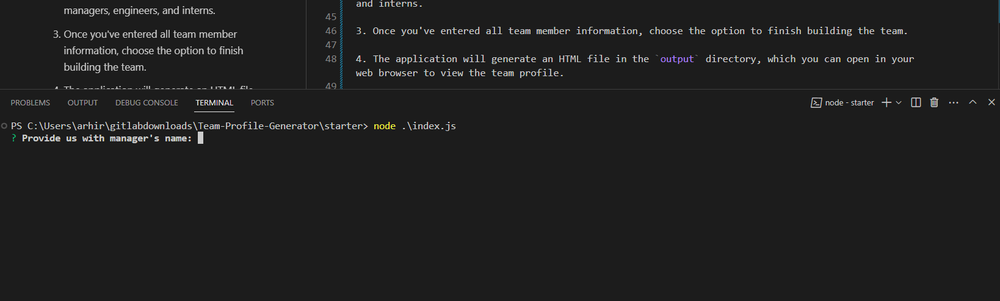
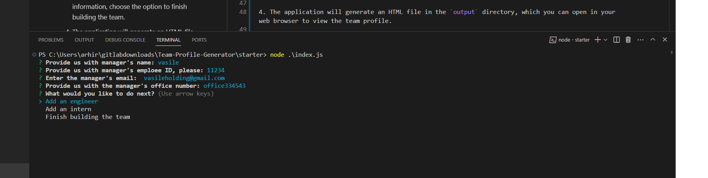
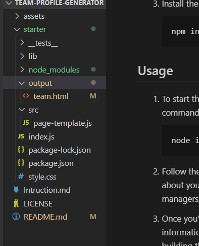
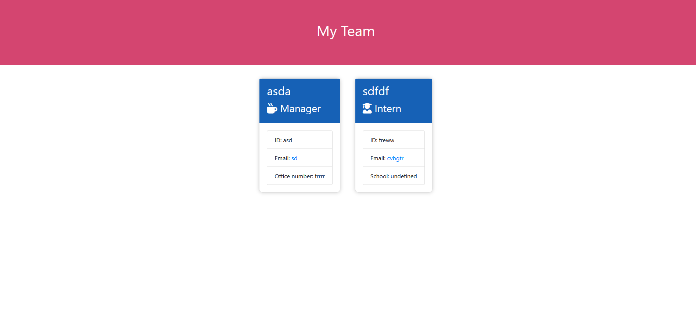

# Team Profile Generator

## Description

The Team Profile Generator is a command-line application that helps you create a webpage displaying information about your development team. This application collects data about team members, including managers, engineers, and interns, and generates an HTML file to represent their details in a visually appealing format.

## Table of Contents

- [Installation](#installation)
- [Usage](#usage)
- [Screenshots](#screenshots)
- [Contributing](#contributing)
- [License](#license)
- [Questions](#questions)

## Installation

1. Clone [the repository](https://github.com/Heisen101/Team-Profile-Generator) to your local machine:

   ```bash
   git clone https://github.com/your-username/your-repo-name.git
   ```

2. Navigate to the project directory:

   ```bash
   cd your-repo-name
   ```

3. Install the required dependencies:

   ```bash
   npm install
   ```

## Usage

1. To start the application, run the following command:

   ```bash
   node index.js
   ```

   

2. Follow the prompts to enter information about your team members, including managers, engineers, and interns.

3. Once you've entered all team member information, choose the option to finish building the team.



4. The application will generate an HTML file in the `output` directory, which you can open in your web browser to view the team profile.

   

## Screenshots



## Contributing

Contributions to this project are welcome. Please open issues or submit pull requests.

## License

This project is licensed under the [MIT License](LICENSE).

## Questions

If you have any questions or need further assistance, feel free to reach out to [Heisen101](https://github.com/Heisen101/Team-Profile-Generator).

---
